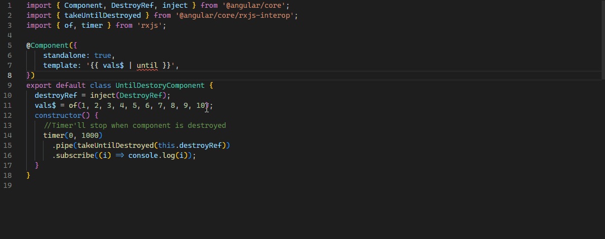

# What's new in Angular 16? New Features and Updates

Hi everyone, in this article we'll talk about the new features and improvments of Angular v16 that published at **May 3, 2023.** There are many good features and improvements in this version. Let's get started!

### First of all `This version(v16) is stable but some API's still in the developer preview!`

- **Syntax & features may change in future versions**

# Table of contents

- **ngcc** is gone
- TypeScript 5.0 support (Non-experimental decorators)
- Create **standalone app** with CLI
- **Esbuild** dev server (Dev. preview)
- Signals (signal, computed, effect) (Dev. preview)
  - https://github.com/angular/angular/discussions/49685
- RxJS Interop (Dev. preview)
  - https://github.com/angular/angular/discussions/49681
- `takeUntilDestroy` operator & Flexible ngOnDestroy (DestroyRef class)
- Autocomplete imports in templates
- Required inputs
- Input binding with router contexts
- Server-side rendering and hydration enhanced

# 1.ngcc is gone

- Angular published _ngcc_ with the arrival of ivy in version 9 and it was a compatibility compiler for the old libraries. In angular 16 this support completely removed

- PR Detail for removed Compatibility Compiler: https://github.com/angular/angular/pull/49101

# 2.TypeScript 5.0 support (Non-experimental decorators)

### In v16 enabling support for TypeScript 5.0 with support for [ECMAScript decorators](https://devblogs.microsoft.com/typescript/announcing-typescript-5-0/#decorators)

# 3.Create standalone app with CLI

We were already creating standalone **Directive**, **Component** and **Pipe** with the CLI but now we can also create standalone app with the command below

```bash
ng new my-app --standalone
```

OR

```bash
npx -p @angular/cli ng new my-app --standalone
```

Also with the schematics will convert your code, remove unnecessary NgModules classes and finally change the bootstrap of the project to use standalone APIs

```bash
ng generate @angular/core:standalone
```

## Output


You’ll get a simpler project output without any NgModules. Additionally, all the generators in the project will produce standalone directives, components, and pipes

# 4.Esbuild dev server (In developer preview)

`Early tests showed over 72% improvement in cold production builds 🚀`

In ng serve now using Vite for the development server, and esbuild powers both your development and production builds

- For the test it change `"browser"` to `"browser-esbuild"` suffix in `angular.json` file.

  

### Last note by Angular team for esbuild

```
Next we’ll be tackling support for i18n before we graduate this project out of developer preview
```

## Compare with **browser** and **browser-esbuild**

### **browser-esbuild**


### **browser** (Initial)


### **browser** Cached (After first build)


# 5.**Signals** (signal, computed, effect) 🚦

### First off all let me drop the [Discussion](https://github.com/angular/angular/discussions/49683)

**Also here's the [documentation](https://angular.io/guide/signals)**

### Maybe it can be the game changer for Angular. Because we were using rxjs for reactivity and it was hard to learn

### Let's take a look the defination of signals from documentation

- A signal is a wrapper around a value that can notify interested consumers when that value changes. 
- Signals can contain any value, from simple primitives to complex data structures.
- A signal's value is always read through a getter function, which allows Angular to track where the signal is used.

_Signals may be either writable or read-only_

### There are definations and examples of signals from documentation but I'll show you some examples from my side


# EXAMPLES

### **[Signal](https://angular.io/api/core/signal)**

```ts
import { Component, WritableSignal } from "@angular/core";

@Component({
  selector: "app-quantity",
  template: `<p>Quantity: {{ quantity() }}</p>`,
})
export class QuantityComponent {
  /**
   * We don't have to define the type of the signal
   * It'll automatically detect the type of the signal
   * In this case it's: WritableSignal<number>
   **/
  quantity = signal(0);

  setQuantity(amount: number) {
    //Set the quantity by the given amount
    this.quantity.set(amount);
  }

  updateQuantity(amount: number) {
    //Increment the quantity by the given amount
    this.quantity.update((curr) => curr + amount);
  }
}
```

```ts
const todos = signal([{ title: "Write an article about signals", done: false }]);

todos.mutate((value) => {
  // Change the first TODO in the array to 'done: true' without replacing it.
  value[0].done = true;
});
```

### **[Computed](https://angular.io/api/core/computed) signals**

- `Computed signals are not writable signals`
- `Computed signal dependencies are dynamic` which means Only the signals actually read during the derivation are tracked. For example, in this computed the **quantity** signal is only read conditionally

```ts
const TAX_RATE = 0.18;

const price = signal(100);
const quantity = signal(1);
//computed function returns a read-only signal
const total: Signal<number> = computed(() => {
  if (price() > 0) {
    return price() * quantity() * (1 + TAX_RATE);
  }
  return 0;
});

console.log(total()); // 118
total.set(200); // Error: Cannot set a computed signal
```

### **[Effects](https://angular.io/api/core/effect)**

Effects are using for creating side effects like `console.log` or `alert` etc.

```ts
const price = signal(1);
const quantity = signal(1);
const total = computed(() => {
  if (price() > 0) {
    return price() * quantity();
  }
  return 0;
});

effect(() => {
  console.log("Total:", total());
  /**
   * Output: Total: 0
   * effects will always get the latest value
   **/
});

price.update((curr) => curr + 1); //Total: 2
price.update((curr) => curr + 1); //Total: 3
price.update((curr) => curr + 1); //Total: 4
price.update((curr) => curr + 1); //Total: 5

price.set(0); //Total: 0
```

## Reading without tracking dependencies

```ts
effect(() => {
  console.log("Total:", untracted(total));
  /**
   * Output: Total: 0
   * Normally it should be 0 and after 2 second 100, but we used untracked function
   * that's why it'll just get the last value and it'll not track the dependencies
   **/
});

price.update((curr) => curr + 1); //Total: 2
price.update((curr) => curr + 1); //Total: 3

price.set(0); //Total: 0

setTimeout(() => {
  price.set(100);
}, 2000);
```

## Comparing _signals_ with _rxjs_

### Let's get the people and count them

```ts
//people.service.ts

//Signals
readonly people = signal(PEOPLE);
readonly count = computed(() => this.people().length);

//Rxjs
private readonly _peopleSubject = new BehaviorSubject<Person[]>(PEOPLE);

get people$(): Observable<Person[]> {
  return this._peopleSubject.asObservable();
}
get count$(): Observable<number> {
  return this.people$.pipe(map((people) => people.length));
}
```

### Filter by department

```ts
//people.service.ts

filterByDepartmentSignal(name: string): void {
  name = name.toLowerCase();
  this.people.update(() =>
    !name
      ? PEOPLE
      : PEOPLE.filter(({ department }) => department.toLowerCase() === name)
  );
}

filterByDepartmentRxjs(name: string): void {
  name = name.toLowerCase();
  this._peopleSubject.next(
    !name
      ? PEOPLE
      : PEOPLE.filter(({ department }) => department.toLowerCase() === name)
  );
}
```

### Add to list

```ts
addSignal(person: Person): void {
  this.people.update((people) => [...people, person]);
}

addRxjs(person: Person): void {
  const { value } = this._peopleSubject;
  this._peopleSubject.next([...value, person]);
}
```

### Remove from list

```ts
//people.service.ts

removeSignal(id: number): void {
  this.people.update((people) => people.filter((p) => p.id !== id));
}

removeRxjs(id: number): void {
  const { value } = this._peopleSubject;
  this._peopleSubject.next(value.filter((person) => person.id !== id));
}
```

# 6.**RxJS Interop**

Like the [async](https://angular.io/api/common/AsyncPipe) pipe, toSignal subscribes to the Observable immediately, which may trigger side effects. The subscription created by toSignal automatically unsubscribes from the given Observable upon destruction of the the component in which toSignal is called.

- In observable cases, the initial value is important because toSignals cannot know that its value will arrive immediately or with a delay.

### **[toSignal](https://angular.io/api/core/rxjs-interop/toSignal)**

```ts
import { Component, inject } from "@angular/core";
import { HttpClient } from "@angular/common/http";
import { toSignal } from "@angular/core/rxjs-interop";
import { Member } from "../models";

const GITHUB_API = "https://api.github.com/orgs/volosoft/public_members";

@Component({
  standalone: true,
  selector: "app-member",
  template: `
    <div class="row">
      <div class="col-sm-12 col-md-6 col-lg-3 mb-2" *ngFor="let member of gitHubService.members()">
        <div class="card card-member">
          <div class="card-header text-center">
            <a class="text-primary text-decoration-none" [href]="member.html_url" target="_blank">{{ member.login }} </a>
          </div>
          <div class="card-body d-flex justify-content-center">
            
          </div>
        </div>
      </div>
    </div>
  `,
})
export class MemberComponent {
  private readonly http = inject(HttpClient);
  readonly members = toSignal(this.http.get<Member[]>(GITHUB_API), {
    initialValue: [],
  });
}
```

### **Output**


### **[toObservable](https://angular.io/api/core/rxjs-interop/toObservable)**

```ts
import { Component, signal } from '@angular/core';

@Component(...)
export class SearchResults {
  query: Signal<string> = inject(QueryService).query;
  query$ = toObservable(this.query);

  results$ = this.query$.pipe(
    switchMap(query => this.http.get('/search?q=' + query))
  );
}
```

# 7.[takeUntilDestroy](https://angular.io/api/core/rxjs-interop/takeUntilDestroyed) operator & Flexible ngOnDestroy (DestroyRef class)

**Operator which completes the Observable when the calling context (component, directive, service, etc) is destroyed.**

```ts
import { Component, DestroyRef, inject } from "@angular/core";
import { takeUntilDestroyed } from "@angular/core/rxjs-interop";
import { timer } from "rxjs";

@Component({
  standalone: true,
  template: "",
})
export default class UntilDestoryComponent {
  destroyRef = inject(DestroyRef);
  constructor() {
    this.destroyRef.onDestroy(console.clear);
    //Timer'll stop and clear the console when component is destroyed
    timer(0, 1000).pipe(takeUntilDestroyed(this.destroyRef)).subscribe(console.log);
  }
}
```

# 8.[Autocomplete](https://blog.angular.io/angular-v16-is-here-4d7a28ec680d#:~:text=Autocomplete%20imports%20in%20templates) imports in templates



# 9.Required inputs

```ts
@Component({
  standalone: true,
  selector: "app-required-input",
  template: `{{ internalName }}`,
})
export class RequiredInputComponent {
  /**
   * What the hack is this? "internalName!"
   * We already mark as required but TS compiler still don't know that.
   * decarators not effects to the TS compiler. For type safety we need to use "!".
   * Angular team will bring a new function like input('name')...
   */
  @Input({ required: true, alias: "name" }) internalName!: string;
}
```

### Usage

```ts
import { RequiredInputComponent } from "./path-to-component";

@Component({
  standalone: true,
  selector: "my-app",
  imports: [RequiredInputComponent],
  template: `<app-required-input [name]="myName" />`,
})
export default class AppComponent {
  myName = "Masum";
}
```

**If we do not pass the name input, it will give an error as follows**


# 10.Input binding with router contexts

```ts
import { Component, Input } from "@angular/core";

@Component({
  standalone: true,
  selector: "app-input-binding",
  template: `<h1>Input binding value: {{ title }}</h1>`,
})
export default class InputBindingComponent {
  @Input() title: string | undefined | null;
}

/**
  {
    path: 'req-inputs/:title',
    loadComponent: () => import('./components/required-inputs.component'),
    resolve: { title: () => 'Hello World!' },
  }

  Priority
  1: resolve: { title: () => 'masum' },
  2: route param: localhost/input-binding/masum
  3: query param: localhost/input-binding?title=masum
 */
```

# 11.Server-side rendering and hydration enhanced (Developer Preview)

[Detailed informations](https://angular.io/guide/hydration#what-is-hydration)

### Sooo What is hydration ?

**Simply define: Hydration is the process that restores the server-side rendered application to the client**

### Why is hydration important?

**Hydration improves application performance by avoiding extra work to re-create DOM nodes**

### It's really easy to apply hydration in Angular 16

```ts
import {
  bootstrapApplication,
  provideClientHydration,
} from '@angular/platform-browser';
...

bootstrapApplication(RootCmp, {
  providers: [provideClientHydration()]
});
```

**That's all, your application is working with the hydration now!**

What's next for hydration? [Check out the roadmap](https://blog.angular.io/whats-next-for-server-side-rendering-in-angular-2a6f27662b67)

# Hydration Example

```ts
//app.config.server.ts

import { mergeApplicationConfig, ApplicationConfig } from "@angular/core";
import { provideServerRendering } from "@angular/platform-server";
import { appConfig } from "./app.config";
import { REQ_TOKEN } from "./req.token";

const serverConfig: ApplicationConfig = {
  providers: [
    provideServerRendering(),
    {
      provide: REQ_TOKEN,
      useValue: "https://jsonplaceholder.typicode.com/users",
    },
  ],
};

export const config = mergeApplicationConfig(appConfig, serverConfig);
```

```ts
//app.config.ts

import { ApplicationConfig } from "@angular/core";
import { provideClientHydration } from "@angular/platform-browser";
import { REQ_TOKEN } from "./req.token";

export const appConfig: ApplicationConfig = {
  providers: [
    provideClientHydration(),
    {
      provide: REQ_TOKEN,
      useValue: "https://api.github.com/users",
    },
  ],
};
```

```ts
//app.component.ts

import { AsyncPipe, NgFor } from "@angular/common";
import { HttpClient, HttpClientModule } from "@angular/common/http";
import { Component, inject } from "@angular/core";
import { Observable, delay } from "rxjs";
import { REQ_TOKEN } from "./req.token";

interface User {
  id: number;
  name: string;
  login: string;
}

@Component({
  selector: "app-root",
  standalone: true,
  imports: [NgFor, AsyncPipe, HttpClientModule],
  template: `
    <div class="container mt-2">
      <div class="card">
        <div class="card-header">
          <h3>Users</h3>
        </div>
        <div class="card-body">
          <table class="table table-border table-hover">
            <thead>
              <tr>
                <th>Id</th>
                <th>Name</th>
              </tr>
            </thead>

            <tbody>
              <tr *ngFor="let user of users$ | async">
                <td>{{ user.id }}</td>
                <td>{{ user?.name || user.login }}</td>
              </tr>
            </tbody>
          </table>
        </div>
      </div>
    </div>
  `,
})
export class AppComponent {
  private readonly URL = inject(REQ_TOKEN);
  private readonly http = inject(HttpClient);

  readonly users$ = this.http.get<User[]>(this.URL).pipe(delay(1000));
}
```

# Output

### SSR Without Hydration


### SSR With Hydration


If we look at the carrefully we can see that the SSR with hydration is not re-rendering the whole page, it's just re-rendering the table body.

# Outro

As we can see, Angular 16 is a huge update and it's coming with a lot of new features. On **ABP** side we are really excited about the new features and we are looking forward to using them in our projects. We hope you are excited too! If you have any questions or feedback, please let us know in the comments section below. Thanks for reading, see you in the next blog post!👋👋

# Resources

- Angular blog -
  Minko Gechev: https://blog.angular.io/angular-v16-is-here-4d7a28ec680d
- Angular documantation: https://angular.io/guide/signals
- InfoWorld - Paul Krill: https://www.infoworld.com/article/3695589/angular-16-previews-new-reactivity-model.html
- Medium - Gaurav Mukherjee: https://itnext.io/angular-16-is-huge-67288a3ff58b
- Medium - Fatima: https://medium.com/gitconnected/angular-16-is-making-big-noise-6a06e9808788
- Twitter Hydration: https://twitter.com/angular/status/1658185482847543311
